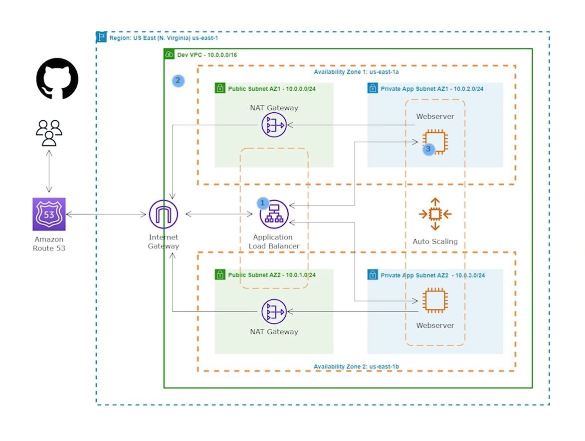

# HOW-TO-DEPLOY-A-STATIC-WEBSITE-ON-AWS

Host a Static Website on AWS

I recently finished a Devops project where I hosted a static html web app on AWS, utilizing the resources listed above.
I have uploaded the reference diagram and scripts I used to deploy
the web app on an Ec2 Instance to a GitHub repository for the project. Please use this information to create a professional and detailed readme file for the project.

1. VPC with public and private subnets in 2 availability zones
2. An internet Gateway in used to allow communication between instance in VPC and the internet.
3. Used 2 Availability zones for high availability and fault tolerance.
4. Resources such as Nat gateway, Bastion host, and Application Load balancer used public subnets

6. Put the webserver and database servers in the private subnets to protect them.
7. The Nat gateway allows instances in the private App subnets and private Data subnets to access the internet.
8. Use Ec2 Instances to host the website.
9. Application Load Balancer is used to distribute web traffic accross an auto scaling group of Ec2 Instances in multiple AZs
10. Used auto scaling Group to dynamically create our Ec2 instances to make our website highly available, scalable, fault tolerance and elastic.
11. use Route Route 53 to register our Domain name and create a record set.
12 Used Github to store our websites.
13. Once the website is installed on the Ec2 Instance, the Ec2 instance is used to create an AMI.

Find below also my bash script for the hosting
#!/bin/bash
sudo su
yum update -y
yum install -y httpd 
cd  /var/www/html
wget https://github.com/taofeeklanre/static-website-Repository/raw/main/Speed%20Free%20Cycle.zip
unzip Speed\ Free\ Cycle.zip 
cp -r /var/www/html/speed/* /var/www/html
cd /var/www/html
rm -rf Speed\ Free\ Cycle.zip
systemctl enable httpd
systemctl start httpd

ChatGPT
Project Title: Static Website Hosting on AWS
Overview:
This project demonstrates the process of hosting a static HTML web application on Amazon Web Services (AWS). The setup involves creating a Virtual Private Cloud (VPC) with public and private subnets across two availability zones for high availability and fault tolerance. Key resources like an Internet Gateway, Nat Gateway, Bastion host, and Application Load Balancer are utilized to enable secure and scalable hosting.

Architecture Diagram:

Deployment Steps:
VPC Setup:

Create a VPC with CIDR block.
Create two public and two private subnets in different availability zones.
Configure route tables for public and private subnets.
Internet Gateway:

Attach an Internet Gateway to the VPC for internet access from public subnets.
NAT Gateway:

Deploy a NAT Gateway in one of the public subnets to allow instances in private subnets to access the internet.
Bastion Host:

Set up a Bastion host in a public subnet for secure SSH access to instances in private subnets.
EC2 Instances:

Launch EC2 instances in private subnets to host the website. Use an AMI with a pre-configured web server (e.g., Apache HTTP Server).
Application Load Balancer (ALB):

Create an ALB to distribute web traffic across the EC2 instances in private subnets. Configure listeners and target groups accordingly.
Auto Scaling Group (ASG):

Configure an ASG to automatically scale EC2 instances based on traffic demands. Use the ALB as the target for the ASG.
Route 53:

Use Route 53 to register a domain name and create a record set pointing to the ALB's DNS name for website access.
GitHub Repository:

Store the website files in a GitHub repository for version control and easy deployment.
Deployment Script:

Use a bash script to automate the deployment process on EC2 instances. The script should update the instance, install necessary packages (e.g., Apache HTTP Server), download website files from the GitHub repository, and start the web server.
Deployment Script:
bash
Copy code
#!/bin/bash
sudo su
yum update -y
yum install -y httpd 
cd /var/www/html
wget https://github.com/taofeeklanre/static-website-Repository/raw/main/Speed%20Free%20Cycle.zip
unzip Speed\ Free\ Cycle.zip 
cp -r /var/www/html/speed/* /var/www/html
cd /var/www/html
rm -rf Speed\ Free\ Cycle.zip
systemctl enable httpd
systemctl start httpd
Conclusion:
Hosting a static website on AWS using these resources and best practices ensures high availability, scalability, fault tolerance, and security. The combination of VPC, subnets, gateways, load balancers, and automation helps create a robust web hosting environment suitable for various applications.

